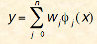
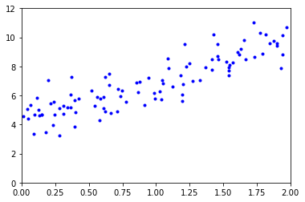

# Gradient descent 
is an optimization algorithm used to minimize some function by iteratively moving in the direction of steepest descent 


# Example
### Conside the following function:


# $\ f(x)=2 x^2 cos(x)-5 x $


### Steps
Our goal is to find the minimum, the one you see on the right, with x between 3 and 4.

We could, in this simple case, compute the derivative, solve f′(x)=0 , etc. But our goal is to understand gradient descent, so let’s do it!

1. Take a random point x0
2. Compute the value of the slope f′(x0)
3. Walk in the direction opposite to the slope: x1=x0−α∗f′(x0) Here, α is this learning rate. And the minus sign enables us to go in the opposite direction.


```python
import numpy as np
def f(x):
    return 2 * x * x * np.cos(x) - 5 * x
x = [-1]
f(x[0])
```


    6.0806046117362795


```python
def df(x):
    return 4 * x * np.cos(x) - 2 * x * x * np.sin(x) - 5

slope = df(x[0])
slope
```


    -5.478267253856766


```python
alpha = 0.05

x.append(x[0] - alpha * slope)
x[1]

```


    -0.7260866373071617


```python
x.append(x[1] - alpha * df(x[1]))
x[2]
```


    -0.4024997370140509


```python
x = [-1.]
for i in range(30):
    x.append(x[i] - alpha * df(x[i]))
x
```


    [-1.0,
     -0.7260866373071617,
     -0.4024997370140509,
     -0.08477906213634434,
     0.18205499002642517,
     0.39684580640116923,
     0.5797318757542436,
     0.7511409760238664,
     0.929843593497496,
     1.1379425635322518,
     1.4100262396071885,
     1.8111367982460322,
     2.4659523010837896,
     3.481091120446543,
     3.9840239754024296,
     3.5799142362878964,
     3.9342838641256046,
     3.6341484369757358,
     3.9000443429762424,
     3.6700891118440984,
     3.874779343531416,
     3.6958142533523755,
     3.8554818096544694,
     3.7149818810428696,
     3.8404639947905914,
     3.729598486599884,
     3.8286534202282554,
     3.7409036078654183,
     3.8193097927393542,
     3.7497262937065647,
     3.8118932296372194]


#### The final value equals to 3.812 which is approximately equals the real value as shown in the graph

In  machine learning what we want to minimize $\ f(x) $ is the cost function "$\ J(w) $ ".

# Linear Regression 




 Y = $\phi$ W , 
                     WHERE Y is the predicted value


##### Let’s generate some linear-looking data to test this equation on


```python
np.random.seed(42)
x = 2 * np.random.rand(100, 1)
y = 4 + 3 * x + np.random.randn(100, 1)
#y1 = 4 + 3 * x 
x
```


    array([[0.74908024],
           [1.90142861],
           [1.46398788],
           [1.19731697],
           [0.31203728],
           [0.31198904],
           [0.11616722],
           [1.73235229],
           [1.20223002],
           [1.41614516],
           [0.04116899],
           [1.9398197 ],
           [1.66488528],
           [0.42467822],
           [0.36364993],
           [0.36680902],
           [0.60848449],
           [1.04951286],
           [0.86389004],
           [0.58245828],
           [1.22370579],
           [0.27898772],
           [0.5842893 ],
           [0.73272369],
           [0.91213997],
           [1.57035192],
           [0.39934756],
           [1.02846888],
           [1.18482914],
           [0.09290083],
           [1.2150897 ],
           [0.34104825],
           [0.13010319],
           [1.89777107],
           [1.93126407],
           [1.6167947 ],
           [0.60922754],
           [0.19534423],
           [1.36846605],
           [0.88030499],
           [0.24407647],
           [0.99035382],
           [0.06877704],
           [1.8186408 ],
           [0.51755996],
           [1.32504457],
           [0.62342215],
           [1.04013604],
           [1.09342056],
           [0.36970891],
           [1.93916926],
           [1.55026565],
           [1.87899788],
           [1.7896547 ],
           [1.19579996],
           [1.84374847],
           [0.176985  ],
           [0.39196572],
           [0.09045458],
           [0.65066066],
           [0.77735458],
           [0.54269806],
           [1.65747502],
           [0.71350665],
           [0.56186902],
           [1.08539217],
           [0.28184845],
           [1.60439396],
           [0.14910129],
           [1.97377387],
           [1.54448954],
           [0.39743136],
           [0.01104423],
           [1.63092286],
           [1.41371469],
           [1.45801434],
           [1.54254069],
           [0.1480893 ],
           [0.71693146],
           [0.23173812],
           [1.72620685],
           [1.24659625],
           [0.66179605],
           [0.1271167 ],
           [0.62196464],
           [0.65036664],
           [1.45921236],
           [1.27511494],
           [1.77442549],
           [0.94442985],
           [0.23918849],
           [1.42648957],
           [1.5215701 ],
           [1.1225544 ],
           [1.54193436],
           [0.98759119],
           [1.04546566],
           [0.85508204],
           [0.05083825],
           [0.21578285]])


```python
import matplotlib.pyplot as plt
plt.plot(x, y, "b.")
plt.axis([0, 2, 0,12 ])
plt.show()
```





```python
phi = np.c_[np.ones((100, 1)), x] # add phi_0 = 1 to each instance
phi

```


    array([[1.        , 0.74908024],
           [1.        , 1.90142861],
           [1.        , 1.46398788],
           [1.        , 1.19731697],
           [1.        , 0.31203728],
           [1.        , 0.31198904],
           [1.        , 0.11616722],
           [1.        , 1.73235229],
           [1.        , 1.20223002],
           [1.        , 1.41614516],
           [1.        , 0.04116899],
           [1.        , 1.9398197 ],
           [1.        , 1.66488528],
           [1.        , 0.42467822],
           [1.        , 0.36364993],
           [1.        , 0.36680902],
           [1.        , 0.60848449],
           [1.        , 1.04951286],
           [1.        , 0.86389004],
           [1.        , 0.58245828],
           [1.        , 1.22370579],
           [1.        , 0.27898772],
           [1.        , 0.5842893 ],
           [1.        , 0.73272369],
           [1.        , 0.91213997],
           [1.        , 1.57035192],
           [1.        , 0.39934756],
           [1.        , 1.02846888],
           [1.        , 1.18482914],
           [1.        , 0.09290083],
           [1.        , 1.2150897 ],
           [1.        , 0.34104825],
           [1.        , 0.13010319],
           [1.        , 1.89777107],
           [1.        , 1.93126407],
           [1.        , 1.6167947 ],
           [1.        , 0.60922754],
           [1.        , 0.19534423],
           [1.        , 1.36846605],
           [1.        , 0.88030499],
           [1.        , 0.24407647],
           [1.        , 0.99035382],
           [1.        , 0.06877704],
           [1.        , 1.8186408 ],
           [1.        , 0.51755996],
           [1.        , 1.32504457],
           [1.        , 0.62342215],
           [1.        , 1.04013604],
           [1.        , 1.09342056],
           [1.        , 0.36970891],
           [1.        , 1.93916926],
           [1.        , 1.55026565],
           [1.        , 1.87899788],
           [1.        , 1.7896547 ],
           [1.        , 1.19579996],
           [1.        , 1.84374847],
           [1.        , 0.176985  ],
           [1.        , 0.39196572],
           [1.        , 0.09045458],
           [1.        , 0.65066066],
           [1.        , 0.77735458],
           [1.        , 0.54269806],
           [1.        , 1.65747502],
           [1.        , 0.71350665],
           [1.        , 0.56186902],
           [1.        , 1.08539217],
           [1.        , 0.28184845],
           [1.        , 1.60439396],
           [1.        , 0.14910129],
           [1.        , 1.97377387],
           [1.        , 1.54448954],
           [1.        , 0.39743136],
           [1.        , 0.01104423],
           [1.        , 1.63092286],
           [1.        , 1.41371469],
           [1.        , 1.45801434],
           [1.        , 1.54254069],
           [1.        , 0.1480893 ],
           [1.        , 0.71693146],
           [1.        , 0.23173812],
           [1.        , 1.72620685],
           [1.        , 1.24659625],
           [1.        , 0.66179605],
           [1.        , 0.1271167 ],
           [1.        , 0.62196464],
           [1.        , 0.65036664],
           [1.        , 1.45921236],
           [1.        , 1.27511494],
           [1.        , 1.77442549],
           [1.        , 0.94442985],
           [1.        , 0.23918849],
           [1.        , 1.42648957],
           [1.        , 1.5215701 ],
           [1.        , 1.1225544 ],
           [1.        , 1.54193436],
           [1.        , 0.98759119],
           [1.        , 1.04546566],
           [1.        , 0.85508204],
           [1.        , 0.05083825],
           [1.        , 0.21578285]])


# Gradient Descent


### Vector form after derivation of cost function


```python
eta = 0.1 # learning rate
n_iterations = 1000
m = 100
w = np.random.randn(2,1) # random initialization
```


```python
for iteration in range(n_iterations):
    gradients = 2/m * phi.T.dot(phi.dot(w) - y)
    w = w - eta * gradients
```


```python
w
```


    array([[4.21509616],
           [2.77011339]])


## Normal equation


```python
w_best = np.linalg.inv(phi.T.dot(phi)).dot(phi.T).dot(y) # applying normal equation

```


```python
w_best
```


    array([[4.21509616],
           [2.77011339]])


```python
phi_new = np.array([[0], [2]])
phi_new_b = np.c_[np.ones((2, 1)), phi_new] # add phi_0 = 1 to each instance
y_predict = phi_new_b.dot(w_best)
phi_new_b
#y_predict
```


    array([[1., 0.],
           [1., 2.]])


```python
plt.plot(phi_new, y_predict, "r-")
plt.plot(x, y, "b.")
plt.axis([0, 2, 0,12 ])
plt.show()
```


## The Recorded section
[See the recorded section](https://youtu.be/e9XHh46F3cw)


```python

```


```python

```


```python

```
